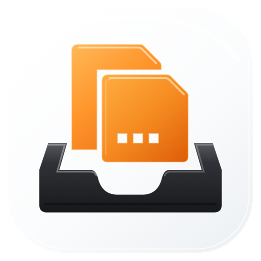

  

<h1 align="center">FramePort</h1>

Import, verify and compress your camera files on Mac.

<a href="README.md">简体中文</a> · <strong>English</strong>

  
  
  

<h3 align="center"><a href="https://github.com/hyrenlab/FramePort-Releases/releases/download/v0.88.0-beta.1/FramePort-0.88-beta.1-macOS-arm64.zip">Download for Mac · Public Beta 1</a></h3>

  <a href="https://github.com/hyrenlab/FramePort-Releases/releases/tag/v0.88.0-beta.1">Release notes &amp; checksums</a> ·
  <a href="https://github.com/hyrenlab/FramePort-Releases/issues/new/choose">Share feedback</a>

FramePort is a macOS app for individual photographers who want to organize their files after a shoot. Connect a memory card, choose the capture dates and destination, preview the file names, then copy and verify the files. You can also choose a backup location for a second copy of your originals.

Already have the files on your Mac? Open standalone compression and drop in photos or videos to make smaller copies for viewing on your phone later. The originals stay as they are; compressed files are saved separately.

Media processing runs on your Mac. We are building FramePort around everyday importing and compression, with less time spent organizing files. The current version does not include AI analysis, phone connections or cloud photo sync.

## Import from a memory card

FramePort reads memory cards and disks mounted on your Mac, as well as existing folders. Files from a camera or recorder must be accessible through a card reader, mounted storage or another file transfer method. PTP / MTP connections are not supported.

To import a batch:

1. Choose a source and scan its photos, videos and audio recordings.
2. Select the dates you want and choose where to save the files. Add a backup location if you want a second copy.
3. Check the original names, the names the imported files will have, and the destination paths.
4. Confirm the import. FramePort verifies copied files with SHA-256 and shows separate import and backup results.

Dates come from the information FramePort can read in each file. If a capture date is missing, it may fall back to the file name or other time information, so check the preview before importing.

SHA-256 verification checks that the copied file content matches the source. By default, originals go into an `Originals` folder inside the album, with a sequence number and date added to their names. Their contents stay unchanged. Enable the lightweight-copy option in the import settings if you also want compressed copies; those are saved separately.

This organization is intended for personal photography. It does not guarantee a complete copy of the card structure. If your editing workflow depends on camera proxies, proprietary containers or complete media packages, keep a separate full backup of the card.

## Compress files already on your Mac

Click "Compress Files" in the toolbar, drop in files, choose an output folder and start. You do not need to create an album or add the files to the import queue first.

Copies go directly into the folder you choose, with `_light` added to their names. If a name is already taken, FramePort adds a number instead of overwriting the existing file. This tool accepts individual photos and videos; it does not scan folders recursively or compress standalone audio recordings.

The list updates as each file finishes. Cancelling keeps completed copies, and you can continue unfinished items in the current batch after a failure or cancellation. Standalone compression batches do not resume after you restart the app.

### Image quality and file size

Compression uses one set of defaults, with no bitrate or quality presets to choose from. Photos become HEIC files with a maximum long edge of 6000 pixels; smaller images are not enlarged. Videos become MP4 files, usually using HEVC, at up to 4K. A video that is already small enough and uses a compatible codec may keep its existing encoding or be repackaged without re-encoding.

The reduction depends on the original resolution, encoding and image content. The reduction in file size cannot be translated directly into a loss of image quality. FramePort does not promise visually lossless compression. RAW rendering and media decoding depend on macOS. Being able to import a format unchanged does not guarantee that your system can preview or compress it.

### Capture time and location

Copies aim to retain readable capture time, time zone, GPS location, and camera make and model from the original. FramePort does not guess missing location or time information. Some manufacturer-specific fields may not transfer to the copy.

The receiving photo app also needs to read those fields correctly. Some Mac Photos samples have passed validation, but iPhone import and iCloud sync have not been validated. Video dates with fractional seconds can still appear with a time offset. After importing, check the date and map in the photo's information panel. Recently Added shows import order, so that view alone cannot tell you whether the capture date was lost.

Existing compressed copies are not updated automatically. To use this version's metadata handling, generate a new copy from the original and check the result in your photo app.

## Download and install

| Requirement | Current support |
| :--- | :--- |
| Mac | Apple Silicon (M series); no Intel build |
| macOS | Declared minimum: macOS 15. Tested on macOS 27; other versions remain unverified |
| Interface languages | Simplified Chinese and English, following your preferred system language |
| Version | 0.88 Public Beta 1; the app reports 0.88 / Build 12; release tag `v0.88.0-beta.1` |

1. Download the ZIP using the link at the top of this page. The release page also provides SHA-256 verification information.
2. Unzip it, drag `FramePort.app` into Applications, and open it.
3. For your first try, use a few files you have already backed up. Complete an import or compression and check the files and capture information. Keep your originals.

> This beta is ad-hoc signed, has not been notarized by Apple, and did not pass Gatekeeper assessment. After checking the download source and file integrity, you may choose to look for the app-specific **Open Anyway** option in System Settings → Privacy & Security after attempting to open FramePort. Some environments may not offer that option. See [Apple’s instructions](https://support.apple.com/en-us/102445).

## What still needs testing

This is a public beta, not a stable 1.0 release. Along with the installation and Photos metadata limitations above, there are a few outstanding issues:

- Cancelling video compression can occasionally leave a temporary folder. The cause is still under investigation.
- Large batches of real footage, long videos, device disconnection and use on another Mac have not been fully validated.
- The latest batch list still needs full checks of its display in the app, keyboard operation and VoiceOver support.

See [known issues](docs/KNOWN_ISSUES.md#english) for details and suggestions, and [verification notes](docs/VERIFICATION.md) for the testing scope.

## Report a problem or share your experience

Tell us if a step leaves you unsure what to do, a control is hard to find, or the result differs from what you expected. Installation failures, card-reading errors, long waits during compression, and incorrect dates or locations in copies are useful reports too.

Include your macOS version, Mac chip, relevant device or file format, the steps you took, and what happened. For date problems in Photos, explain how you imported the file and whether the discrepancy appears in the information panel or Recently Added.

[Report a bug](https://github.com/hyrenlab/FramePort-Releases/issues/new?template=bug_report.yml) · [Share your experience](https://github.com/hyrenlab/FramePort-Releases/issues/new?template=feedback.yml)

GitHub Issues are public. You do not need to upload personal footage or full logs; screenshots and samples are optional. Remove names, identifying information, full paths, device serial numbers and precise locations before sharing.

## About this repository

This repository provides FramePort downloads, instructions and a place for feedback. The app's source code remains private. GitHub's automatic **Source code** archives contain only this public repository's documentation and icon, **not the app installer or app source**.

See [LICENSE](LICENSE) for usage terms and [THIRD_PARTY_NOTICES](THIRD_PARTY_NOTICES.md) for third-party data attribution.
